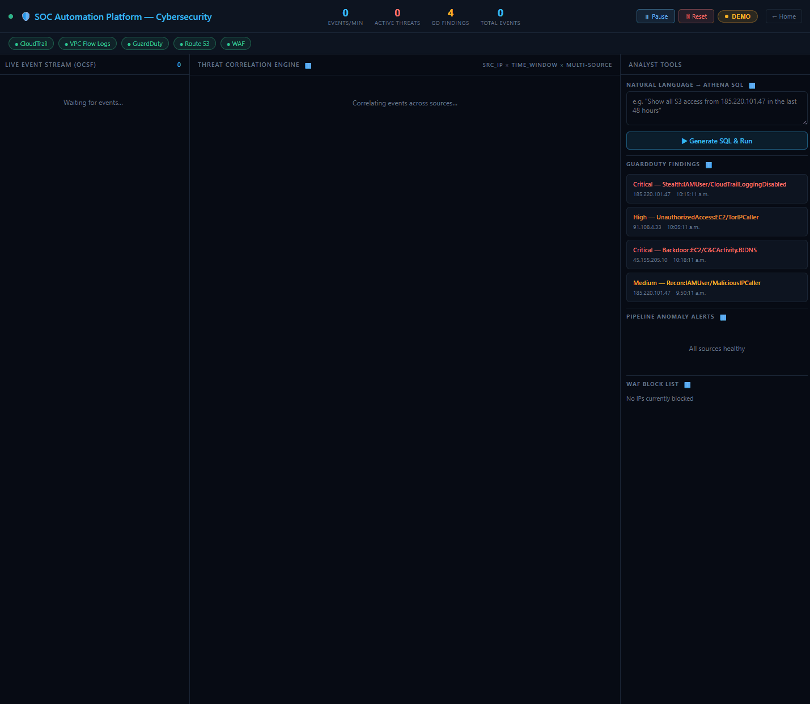
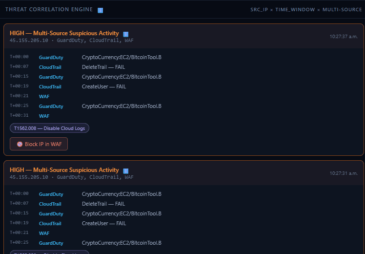
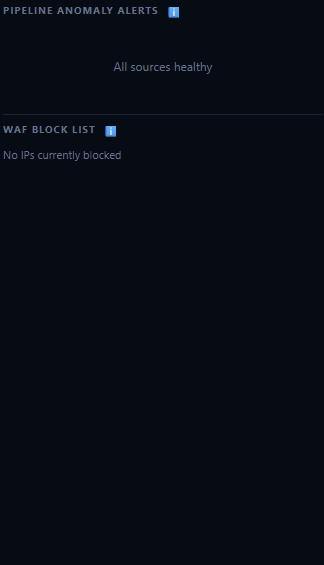
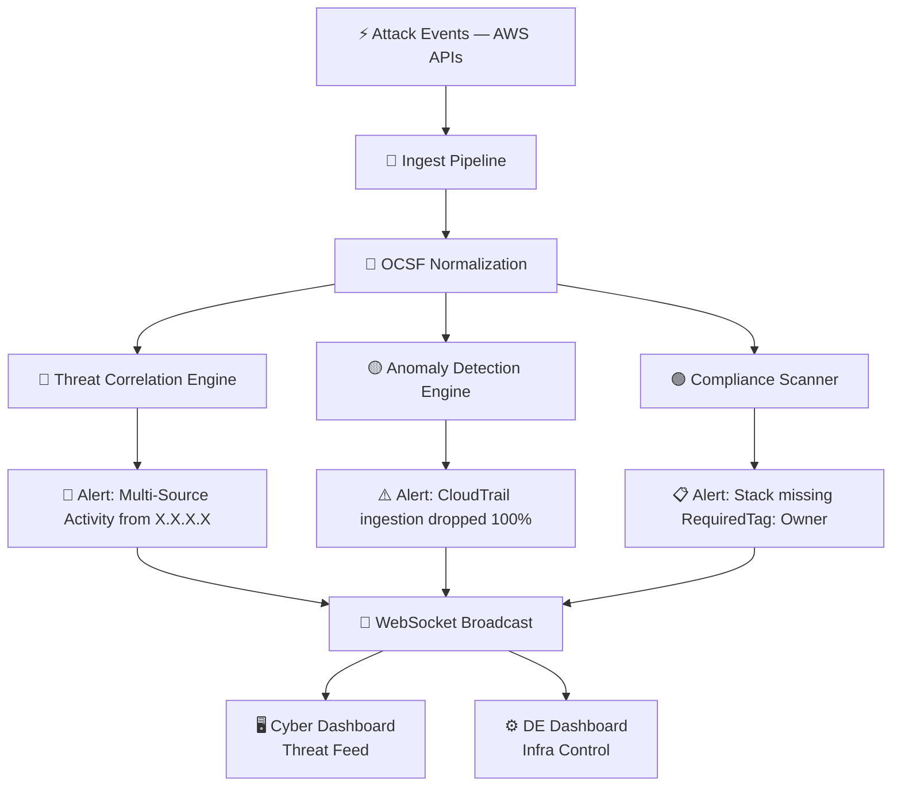
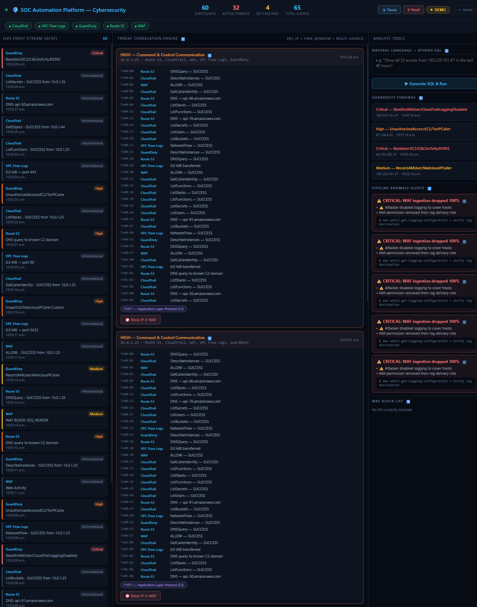
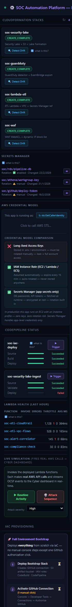
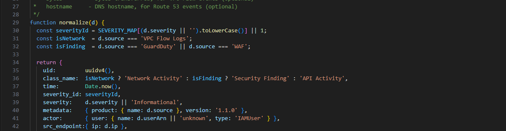
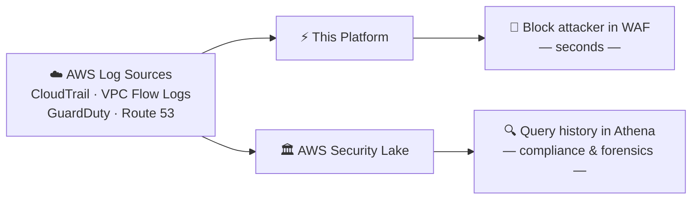

# SOC Automation Platform — AWS Real-Time Threat Detection

> A real-time security operations platform built on AWS that detects, correlates, and responds to cloud threats — live, in a browser, with one click to block an attacker.

---

## 🎬 See It In Action

### Full Attack Simulation
*A 7-stage MITRE ATT&CK kill chain fires against a live AWS account. Watch the platform detect, correlate, and surface the threat in real time.*

---

### Threat Correlation Card Firing
*Same attacker IP appears across CloudTrail, VPC Flow Logs, GuardDuty, and Route 53 — the engine correlates all 4 sources into one incident card with MITRE tags and a one-click Block IP button.*

---

### Anomaly Detection — Log Silence Alert
*The attacker ran `DeleteTrail` to cover their tracks. Within seconds, the anomaly engine detected the 100% drop in Route 53 ingestion and fired a CRITICAL alert.*

---

### Blocking the IP in AWS WAF — Live
*One click. The platform calls the AWS WAFv2 API and adds the attacker IP to a real IP set attached to a real Web ACL — no console, no CLI.*

---

## What This Is

A **security operations center (SOC) in a box** — one browser tab, full visibility into an AWS account, real automated response.

Most security tools tell you what happened yesterday. This tells you what is happening right now.

---

## What It Does

### Three Detection Engines Running in Parallel

| Engine | What It Watches | When It Fires |
|---|---|---|
| **Threat Correlation** | Same IP across multiple log sources | IP seen in 4+ sources (CloudTrail, VPC Flow Logs, GuardDuty, Route 53) within the time window |
| **Anomaly Detection** | Event volume per source over time | Ingestion rate spikes or drops > 60% from baseline |
| **Compliance Scanner** | CloudFormation stack metadata | Stack deployed without required security tags |

Every event that enters the platform passes through all three engines simultaneously.

---

### The 7-Stage Attack It Can Detect

| Stage | MITRE Technique | What Happened |
|---|---|---|
| Reconnaissance | — | `GetCallerIdentity` — attacker probing the account |
| Discovery | — | `ListUsers` — mapping what's in the account |
| Initial Access | **T1078** — Valid Accounts | `AssumeRole` — escalating with stolen credentials |
| Credential Access | **T1552.004** — Cloud Secrets | `GetSecretValue` — pulling secrets from Secrets Manager |
| Discovery II | — | `ListBuckets` — finding data to steal |
| Exfiltration | — | `GetObject` — data leaving the account |
| Defense Evasion | **T1562.008** — Disable Cloud Logs | `DeleteTrail` — attacker trying to hide |
| Command & Control | **T1071** — App Layer Protocol | C2 beacon — attacker's machine calling home |

---

### Live AWS Integration

This is not a mock. These are real AWS API calls:

| Action | AWS Service | What Actually Happens |
|---|---|---|
| Block IP | **WAFv2** | Adds IP to a real IP set on a live Web ACL |
| Deploy Stack | **CloudFormation** | Creates real AWS resources in your account |
| GuardDuty Alerts | **GuardDuty** | Pulls live findings from an active detector |
| Compliance Scan | **CloudFormation** | Reads real stack tags via `describeStacks` |
| Delete Stack | **CloudFormation** | Tears down stacks in dependency order with live status |

---

## Architecture Overview

---

## Two Dashboards

### Cyber Dashboard — Live Threat Feed

- Real-time event feed with source tagging (CloudTrail, GuardDuty, Route 53...)
- Correlation cards with full attack timelines and MITRE ATT&CK tags
- Anomaly alerts with baseline vs actual
- One-click IP blocking via WAF

---

### DE Dashboard — Infrastructure Control

- Deploy / delete AWS security stacks directly from the browser
- View deployed Lambda functions and CodePipeline status
- Trigger baseline activity or full attack simulations
- Stack-level compliance scan results

---

## AWS Stacks Deployed

Three CloudFormation stacks — all defined as IaC, all deployable from the DE dashboard:

| Stack | Key Resources |
|---|---|
| **soc-guardduty** | GuardDuty detector · S3 findings bucket · EventBridge rule (severity ≥ 7) |
| **soc-waf** | WAFv2 IP set `soc-block-list` · WAFv2 Web ACL |
| **soc-demo-resources** | S3 data bucket · Secrets Manager secret |

---

## Real vs Simulated

| Component | Real? |
|---|---|
| AWS API calls (AssumeRole, GetSecretValue, ListBuckets) | ✅ Real — appear in CloudTrail |
| GuardDuty detector | ✅ Real — live AWS resource |
| WAF IP blocking | ✅ Real — live WAFv2 API call |
| CloudFormation stacks | ✅ Real — deployed to AWS account |
| DeleteTrail (stage 6) | 🟡 Simulated — injected as event, no actual damage |
| C2 Traffic (stage 7) | 🟡 Simulated — injected as event, no real outbound connection |

---

## How This Relates to AWS Security Lake

AWS Security Lake centralizes security data at scale — ingesting logs from CloudTrail, VPC Flow Logs, Route 53, GuardDuty, normalizing to OCSF, and storing in S3 for Athena queries. This platform implements the same OCSF normalization on every ingest:

This platform and Security Lake are **complementary layers**, not competitors:

| | This Platform | AWS Security Lake |
|---|---|---|
| **Purpose** | Real-time detection & response | Long-term storage & compliance |
| **Latency** | Seconds | 10–15 minutes |
| **Best for** | Active threat, live blocking | Historical investigation, audits |
| **Query style** | Live WebSocket feed | Athena SQL |
| **OCSF** | Normalizes on ingest | Native schema |
| **Cost** | Minimal (compute only) | Storage + query costs at scale |

### How they work together in a real environment

The real-time layer catches and stops the attack. Security Lake stores the full record for the post-incident investigation, compliance report, or insurance claim.

---

## The One-Liner

> *Security Lake tells you what happened last week. This tells you what's happening right now.*
